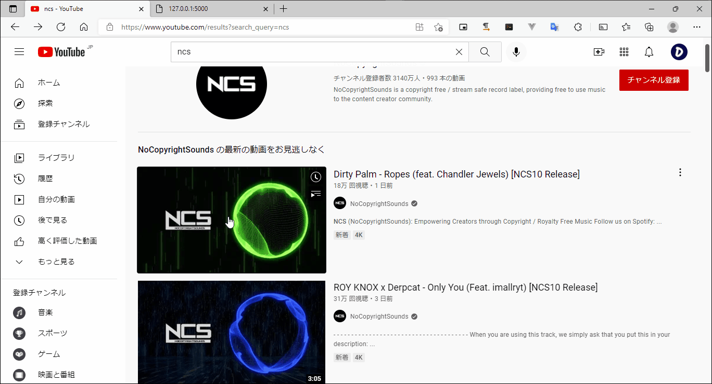

# youtube-dl-audio-api
 
This is an api that returns the audio url of the video using youtube-dl.
 
## DEMO

  
test server:  
https://youtube-dl-audio-api.herokuapp.com/
## Requirement

* python3
* youtube-dl
* flask
* flask-cors
* gunicorn

## Usage
 
### Install
```bash
git clone https://github.com/matumasadev02/youtube-dl-audio-api.git
cd youtube-dl-audio-api
pip install -r requirements.txt
```
or Deploy to Heroku
 
[](https://heroku.com/deploy)  

### Run
```bash
gunicorn app:app
```
### Redirect to audio url:  
```127.0.0.1:8000/?url=[url]```  
or  
```127.0.0.1:8000/?query=[keyword]``` 

### Return json:  
```127.0.0.1:8000/info?url=[url]```  
or  
```127.0.0.1:8000/info?query=[keyword]```

response:
```
{
    url: "https://www.example.com/hogehoge.m4a"
}
```  
## Author

This program was made by matumasadev02.
 
* website: https://www.dev02.net/
* E-mail: matumasadev02@gmail.com
 
## License
youtube-dl-audio-api is released into the public domain.
